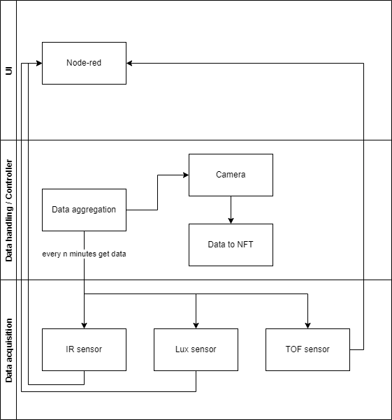

# Intro

This is repository of a innovation project done for Nokia. The idea here is to create a system which gathers data from various different sensors. The sensor could ultimately be anything. The data aquisiton functionality is being abstracted so that the system doesn't need to know what kind of a sensor has been attached to it.



Above we can see the process diagram of the system. Currently there are three sensors which compose the data acquisition layer. 

The second layer is the data handling / controller layer where the data is gathered and verified. 

The UI layer does what you would expect, it shows some pretty graphs and information gathered from the sensors.

## Process

The plan is to build a system which checks if a person is in the proximity of the webcam. If this is true, the webcam takes a picture. This is done with the general purpose system do demonstrate it's capabilities.


The data is gathered from the sensors in the controller layer. The data aggreagtion process gets the data from the sensor every `n` minutes. 

TODO: 
* create a UML class diagram...
* global thread safe object to store the data from mqtt.
  * queue?


## MQTT topic naming conventions

Sensors are named as `sensor/webcam`, `sensor/ir`, `sensor/lux`, `sensor/tof`.

### Management channel
```
management/
```

### Alert channel
```
alert/
```

### Data channels
```
data/<hostname>/<sensor>/<measurement>
```
Measurement here means the measured data. This could be array of pixels, temperature, distance etc
