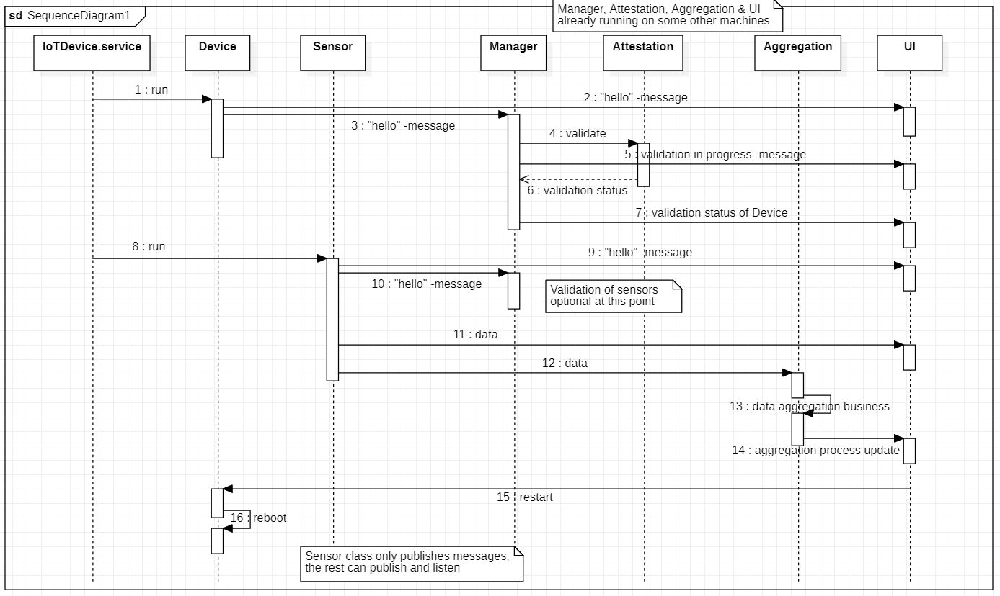

# Intro

This is repository of a innovation project done for Nokia. The idea is to build a framework which allows rapid development of different kinds of sensor management systems. The sensor could ultimately be anything. 

The data aquisiton functionality is being abstracted so that the system doesn't need to know what kind of a sensor has been attached to it.

The system handles all communication via MQTT messages. 

# Installation

1.  a) Go to the folder /opt/ on the terminal

    b) Clone the repository using git: `sudo git clone https://github.com/teemvil/iot.git`. This downloads all the necessary library files.
    
    c) cd to the install folder `cd iot/IoT/install` and run the installation script: 
    ```
    sudo python3 install.py
    ```

    The script creates iot.devices.service and iot.sensors.service files to etc/systemd/system. The script also creates two config files to `/etc/iotDevice/` these are used as MQTT client configuration and as a specific device configuration. The device configuration file should contain the itemid of the pi on which the scripts are running on.
    
    d) Enable the services using systemd:

    ```
    sudo systemctl enable iot.devices.service
    sudo systemctl start iot.devices.service
    ```

    ```
    sudo systemctl enable iot.sensors.service
    sudo systemctl start iot.sensors.service
    ```

2. Create sensor/implementations 

    To install IoTLibrary as a package, run `pip3 install .` in the secure_sensor_management_system folder.

    a) Create a new folder for the sensor under `/opt/iot/secure_sensor_management_system/`    

    b) Create new sensor script. Most important thing is to inherit the BasicSensor from SensorManagementLibrary.
    
    ```python
    from SensorManagementLibrary.BasicSensor import BasicSensor
    ```

    c) Create configuration file for the sensor and name it as `sensor_config.json`. The file should look like this:
    ```json
    {
        "name": "EXAMPLE RNGsensor",
        "frequency": 1,
        "prefix": "EXAMPLE"
    } 
    ```
    
    Store it in the same folder as the sensor python file.

    d) Change the templates to fit your specific sensor needs    

    e) Add your new sensor to IotSensorStartup.py so that it can be started as the pi starts up.

        # from YourNewSensor import YourNewSensor
        # x = YourNewSensor()
        # x.run()

3. Run the newly created script:

```bash
python3 YourNewSensor.py
```

4. To get the Manager working you need to first give correct ip and port addresses. This is done by modifying the config.json file which is in the ManagementAttestor folder. Then just run `python3 Manager.py`


# Design

The system is build so that every class inherits a MQTT client from the IoTElement class. There is also a configuration file located in xxx which has all the necessary options to connect to the MQTT broker and send correct types of messages.


# Data flow

When the system starts up it sends various MQTT messages to notify the broker about the state of the various subsystems. Firstly the validity of the device running the sensor script is checked. The sensor startup doesn't depend on the validity check. We can just see if the device is valid or not. 



## MQTT topic naming conventions

Sensors are named as `sensor/webcam`, `sensor/ir`, `sensor/lux`, `sensor/tof`.

### Management channel
```
management/
```

### Alert channel
```
alert/
```

### Data channels
```
data/<hostname>/<sensor>/<measurement>
```
Measurement here means the measured data. This could be array of pixels, temperature, distance etc


Most important payload fields:
itemid and event

Document the different events:
"device start up", "sensor start up", "platform? start up", etc...
