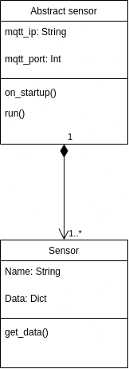

# Sensors

Here's the source code for the different pis and the sensors.

Plan is to use base class for main functionality so the sensor can be changed easily without much modification to the code.

## Process

The process on the device should contain validation on pretty much every step of the way. If the validation fails then the system sends an alert message which should be handled accordingly. This is still in progress.

There is a device manager process running on the device which handles all the communication between the device and the other parts of the system. It also has functionality to start/restart/shutdown the sensor process and the pi itself. 

